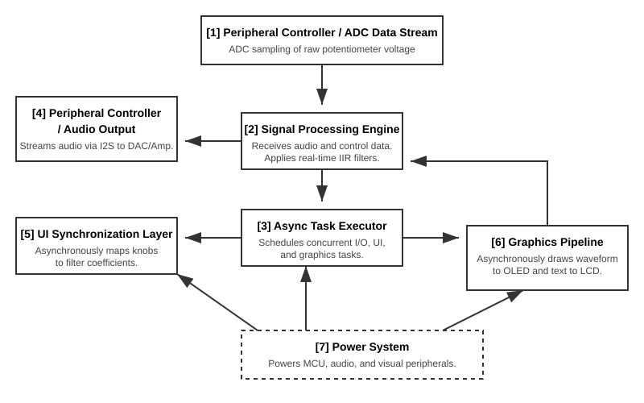

# RustyRhythm
An interactive real-time audio processing station programmed in Rust that manipulates sound based on user input and digital filters.

:::info 

**Author**: Melisa Osman \
**GitHub Project Link**: [Insert link here]

:::

## Description

This project consists of an interactive, real-time digital signal processing (DSP) system based on the STM32U545RE-Q microcontroller. The project's objective is to provide a practical learning environment where users can experiment with high-fidelity audio output, frequency-specific filtering, and time-based effects.

## Motivation

I chose this project because I am fascinated by how music and technology intersect. My goal was to build a device that can process high-quality sound in real-time without needing a computer. I wanted to see if I could use the Rust programming language to handle complex audio math and hardware controls simultaneously, ensuring the system is both fast and reliable.

## Architecture 

The system is designed around an asynchronous task-driven model. Instead of hardware parts, the software architecture is divided into the following logical components:

* **Async Task Executor**: The central "brain" (Embassy) that schedules and runs multiple operations at once without them blocking each other.
* **Signal Processing Engine**: The core logic that receives raw digital audio and applies mathematical IIR filters (Low-Pass/High-Pass) in real-time.
* **Peripheral Controller**: Manages the flow of data between the internal memory and the external hardware (DAC and ADC) using DMA (Direct Memory Access) to keep audio latency low.
* **UI Synchronization Layer**: A dedicated task that listens for changes in the physical knobs (ADC values) and updates both the audio filter coefficients and the visual displays.
* **Graphics Pipeline**: Translates audio frequency data into visual waveforms for the OLED and text strings for the LCD.

**Component Connectivity:**

1.  The **Peripheral Controller** streams data into the **Signal Processing Engine**.
2.  The **Signal Processing Engine** modifies the data based on variables sent from the **UI Synchronization Layer**.
3.  The **UI Synchronization Layer** simultaneously pushes visual updates to the **Graphics Pipeline**.
4.  Everything is managed and timed by the **Async Task Executor** to ensure the audio never stutters while the screen is updating.

## Log

### Week 5 - 11 May
- Set up the Rust embedded toolchain (probe-rs, flip-link) and configured the `memory.x` for the STM32U545 architecture.
- Initialized the **Embassy** executor and configured the system clock tree to support high-speed I2S data rates.
- Researched and implemented the mathematical model for fixed-point IIR biquad filters using `micromath`.
- Successfully validated 16-bit stereo audio streaming via **DMA** to the PCM5102 DAC with a generated 440Hz sine wave.

### Week 12 - 18 May
- Developed the asynchronous I2C bus manager to drive the SSD1306 OLED and 16x2 LCD concurrently without blocking.
- Implemented a double-buffering scheme for the display driver to prevent visual flickering during high CPU load.
- Designed the UI state machine that maps physical ADC potentiometer inputs to real-time filter coefficients.
- Integrated the `embedded-graphics` library to render live waveform visualizations based on the audio buffer data.

### Week 19 - 25 May
- Finalized the **Fixed-Point Low-Pass and High-Pass filter** logic, calibrating the Q-factor and frequency cutoffs.
- Integrated the PAM8403 amplifier circuit and implemented software-based gain control to prevent signal clipping.
- Developed robust error handling using Rust’s `Result` type for peripheral initialization and bus collisions.
- Conducted "Stress Tests" to ensure the audio processing thread maintains low latency while the display thread is updating.

## Hardware

The system uses a high-performance STM32 microcontroller coupled with dedicated audio hardware and dual visual interfaces for real-time monitoring.

### Schematics

Place your KiCAD or similar schematics here in SVG format.

### Bill of Materials

| Device | Usage | Price |
|--------|--------|-------|
| [STM32 NUCLEO-U545RE-Q](https://ro.mouser.com/ProductDetail/STMicroelectronics/NUCLEO-U545RE-Q) | Main Processing Unit | [106.59 RON](https://ro.mouser.com/ProductDetail/STMicroelectronics/NUCLEO-U545RE-Q) |
| [PCM5102 DAC Module](https://www.optimusdigital.ro/en/audio-video/247-pcm5102-dac-module.html) | High-fidelity I2S Output | [55.00 RON](https://www.optimusdigital.ro/en/audio-video/247-pcm5102-dac-module.html) |
| [PAM8403 Amplifier Module](https://www.bitmi.ro/electronica/module/modul-amplificator-audio-stereo-pam8403-2x3w-10519.html) | Audio Amplification | [6.50 RON](https://www.bitmi.ro/electronica/module/modul-amplificator-audio-stereo-pam8403-2x3w-10519.html) |
| [3W 4-Ohm Speaker](https://sigmanortec.ro/en/speaker-40mm-3w) | Sound Reproduction | [7.50 RON](https://sigmanortec.ro/en/speaker-40mm-3w) |
| [OLED SSD1306 (128x64)](https://sigmanortec.ro/Display-OLED-0-96-I2C-IIC-Albastru-p135055705) | Waveform Visualization | [16.96 RON](https://sigmanortec.ro/Display-OLED-0-96-I2C-IIC-Albastru-p135055705) |
| [16x2 I2C LCD Module](https://www.bitmi.ro/electronica/afisaje/ecran-lcd1602-cu-modul-i2c-iic-10642.html) | Metadata Display | [24.99 RON](https://www.bitmi.ro/electronica/afisaje/ecran-lcd1602-cu-modul-i2c-iic-10642.html) |
| [10k Potentiometer (Slide)](https://sigmanortec.ro/en/10k-linear-potentiometer-module) | Volume and EQ Knobs | [12.52 RON](https://sigmanortec.ro/en/10k-linear-potentiometer-module) |
| [Tactile Button Set](https://www.bitmi.ro/electronica/set-180-mini-butoane-switch-10523.html) | Play/Pause Control | [30.49 RON](https://www.bitmi.ro/electronica/set-180-mini-butoane-switch-10523.html) |
| [400-Point Breadboard](https://www.bitmi.ro/electronica/breadboard-400-puncte-pentru-montaje-electronice-rapide-10633.html) | Prototyping | [6.99 RON](https://www.bitmi.ro/electronica/breadboard-400-puncte-pentru-montaje-electronice-rapide-10633.html) |
| [Jumper Wires (40 pcs)](https://www.bitmi.ro/electronica/set-fire-dupont-tata-tata-20cm-40-bucati-10634.html) | Wiring | [8.99 RON](https://www.bitmi.ro/electronica/set-fire-dupont-tata-tata-20cm-40-bucati-10634.html) |

## Software

| Library | Description | Usage |
|---------|-------------|-------|
| [embassy-stm32](https://github.com/embassy-rs/embassy/tree/main/embassy-stm32) | Core Framework | STM32 Hardware Abstraction and DMA |
| [embassy-executor](https://github.com/embassy-rs/embassy/tree/main/embassy-executor) | Async Framework | Task management and scheduling |
| [embassy-time](https://github.com/embassy-rs/embassy/tree/main/embassy-time) | Timing Library | Refresh rates for audio and UI tasks |
| [micromath](https://github.com/tarcieri/micromath) | DSP Math | Fast fixed-point arithmetic for filters |
| [embedded-graphics](https://github.com/embedded-graphics/embedded-graphics) | 2D graphics library | Used for drawing to the display |
| [embedded-hal](https://github.com/rust-embedded/embedded-hal) | HAL Traits | Interface for I2C and audio peripherals |
| [cortex-m](https://github.com/rust-embedded/cortex-m) | Core Architecture | Low-level ARM support |
| [panic-probe](https://github.com/knurling-rs/panic-probe) | Panic Handler | System debugging and robustness |

## Links

1. [Embassy Framework Documentation](https://embassy.dev/) - Official docs for the async Rust framework powering the real-time executor.
2. [STM32 Nucleo-U545RE-Q Product Page](https://www.st.com/en/evaluation-tools/nucleo-u545re-q.html) - Crucial for downloading the board's user manual, schematics, and pinout diagrams.
3. [PCM5102 DAC Datasheet](https://www.ti.com/product/PCM5102) - Essential for understanding I2S timing requirements and high-fidelity audio configuration.
4. [The Embedded Rust Book](https://docs.rust-embedded.org/book/) - The definitive guide for understanding embedded Rust concepts, memory safety, and tooling.
5. [Embassy STM32 GitHub Examples](https://github.com/embassy-rs/embassy/tree/main/examples/stm32u5) - Reference code showing exactly how to configure I2S, I2C, and DMA on the STM32U5 series using Embassy.
6. [SSD1306 Rust Driver Documentation](https://docs.rs/ssd1306/latest/ssd1306/) - Guide for interfacing with the OLED display to render real-time waveforms using `embedded-graphics`.
7. [Fixed-Point Arithmetic for Audio DSP](https://pbat.ch/dsp/fixedpoint/) - A detailed resource for implementing the mathematical biquad filters without using floating-point hardware.